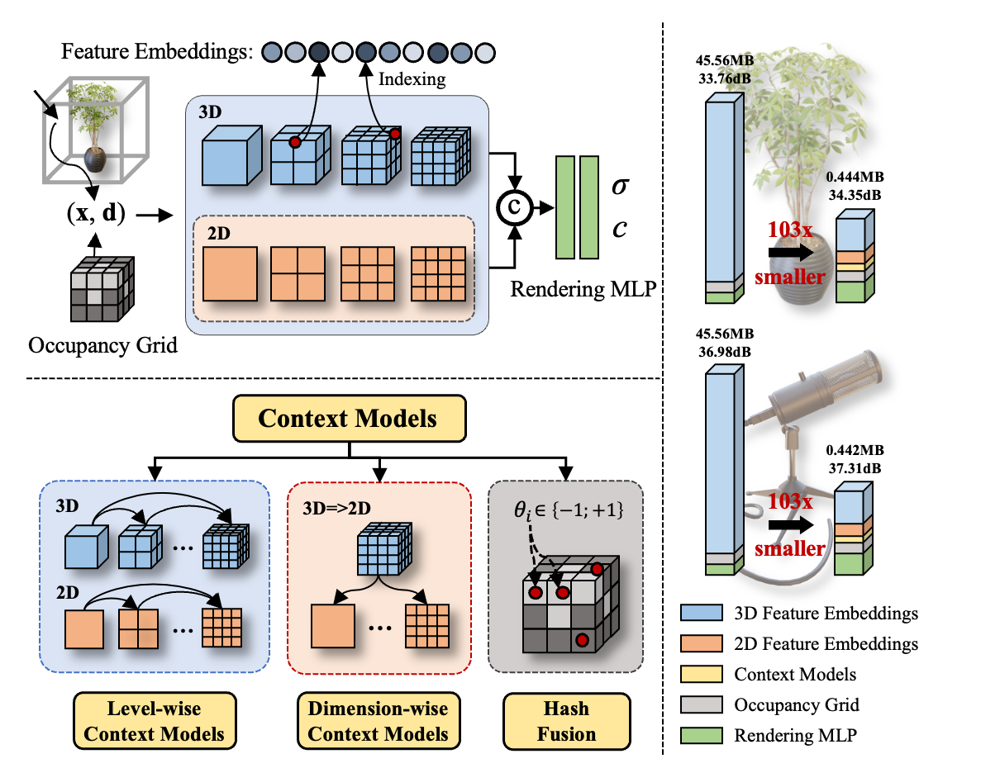
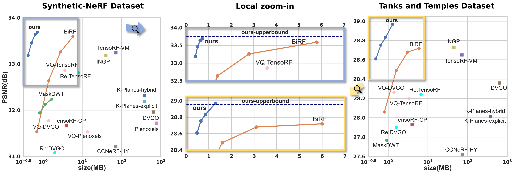

# [CVPR'24] CNC
Official Pytorch implementation of **Har Far Can We Compress Instant-NGP-Based NeRF?**.

[Yihang Chen](https://yihangchen-ee.github.io), 
[Qianyi Wu](https://qianyiwu.github.io), 
[Mehrtash Harandi](https://sites.google.com/site/mehrtashharandi/),
[Jianfei Cai](http://jianfei-cai.github.io)

[[`Paper`](https://openaccess.thecvf.com/content/CVPR2024/papers/Chen_How_Far_Can_We_Compress_Instant-NGP-Based_NeRF_CVPR_2024_paper.pdf)] [[`Arxiv`](https://arxiv.org/abs/2406.04101)] [[`Project`](https://yihangchen-ee.github.io/project_cnc/)] [[`Github`](https://github.com/YihangChen-ee/CNC)]

## Links
Welcome to check a series of works from our group on 3D radiance field representation compression as listed below:
- 🎉 [CNC](https://github.com/yihangchen-ee/cnc/) [CVPR'24] is now released for efficient NeRF compression! [[`Paper`](https://openaccess.thecvf.com/content/CVPR2024/papers/Chen_How_Far_Can_We_Compress_Instant-NGP-Based_NeRF_CVPR_2024_paper.pdf)] [[`Arxiv`](https://arxiv.org/abs/2406.04101)] [[`Project`](https://yihangchen-ee.github.io/project_cnc/)]
- 🏠 [HAC](https://github.com/yihangchen-ee/hac/) [ECCV'24] is now released for efficient 3DGS compression! [[`Paper`](https://www.ecva.net/papers/eccv_2024/papers_ECCV/papers/01178.pdf)] [`Arxiv`](https://arxiv.org/abs/2403.14530)] [[`Project`](https://yihangchen-ee.github.io/project_hac/)]
- 🚀 [FCGS](https://github.com/yihangchen-ee/fcgs/) [ARXIV'24] is now released for fast optimization-free 3DGS compression! [[`Arxiv`](https://arxiv.org/abs/2410.08017)] [[`Project`](https://yihangchen-ee.github.io/project_fcgs/)]

## Overview
<p align="left">

</p>

In this paper, we introduce the Context-based NeRF Compression (CNC) framework, 
which leverages highly efficient context models to provide a storage-friendly NeRF representation. 
Specifically, we excavate both level-wise and dimension-wise context dependencies to enable probability prediction for information entropy reduction. 
Additionally, we exploit hash collision and occupancy grids as strong prior knowledge for better context modeling.

## Performance
<p align="left">

</p>

## Installation

We tested our code on a server with Ubuntu 20.04.1, cuda 11.8, gcc 9.4.0

1. Create a new environment to run our code
```
conda create -n CNC_env python==3.7.11
conda activate CNC_env
```
2. Install necessary dependent packages
```
pip install -r requirements.txt
pip install ninja
```
You might need to run the following command before continuing.
```
pip uninstall nvidia-cublas-cu11
```
3. Install [tinycudann](https://github.com/nvlabs/tiny-cuda-nn)
4. Install our CUDA backens
```
pip install gridencoder
pip install my_cuda_backen
```
5. Manually replace the nerfacc package in your environment (`PATH/TO/YOUR/nerfacc`) by ours (`./nerfacc`).

## Code Execution
1. Put dataset to `./data` folder, such as `./data/nerf_synthetic/chair` or `./data/TanksAndTemple/Barn`
2. To train a scene in nerf_synthetic or tanks_and_temple dataset, conduct the following.
3. We use a learning rate of `1e-2` in our paper for both MLPs but `6e-3` in this repo as we find it is more stable.
```
CUDA_VISIBLE_DEVICES=0 python examples/train_CNC_nerf_synthetic.py --lmbda 0.7e-3 --scene chair --sample_num 150000 --n_features 8
CUDA_VISIBLE_DEVICES=0 python examples/train_CNC_tank_temples.py --lmbda 0.7e-3 --scene Barn --sample_num 150000 --n_features 8
```

Optionally, you can try `--lmbda` in [0.7e-3, 1e-3, 2e-3, 4e-3] to control rate,
and try `--sample_num` in [150000, 200000], and `--n_features` in [1, 2, 4, 8] to adjust training time and performance tradeoff.

Please use `--sample_num 150000` for `--n_features 8` and `--sample_num 200000` otherwise

The code will automatically run the entire process of: **training, encoding, decoding, testing**.

3. Output data includes:
1) Recorded output results in `./results`. (Including fidelity, size, training time, encoding/decoding time)
2) Encoded bitstreams of the hash grid are in `./bitstreams`

## Attention: Common Issues You Might Encounter
1. Our `gcc` version is 9.4.0. If you encounter RuntimeError, please check your `gcc` version.
2. In some cases, it may be necessary to uninstall `nvidia-cublas-cu11` before installing `tinycudann` and `our CUDA backens` 
3. If you install `nerfacc` using pip, the code will need to build the CUDA code on the first run (JIT). See [nerfacc](https://www.nerfacc.com/#installation) for more details.


## Contact

- Yihang Chen: yhchen.ee@sjtu.edu.cn

## Citation

If you find our work helpful, please consider citing:

```bibtex
@inproceedings{cnc2024,
  title={How Far Can We Compress Instant-NGP-Based NeRF?},
  author={Chen, Yihang and Wu, Qianyi and Harandi, Mehrtash and Cai, Jianfei},
  booktitle={Proceedings of the IEEE/CVF Conference on Computer Vision and Pattern Recognition},
  year={2024}
}
```
